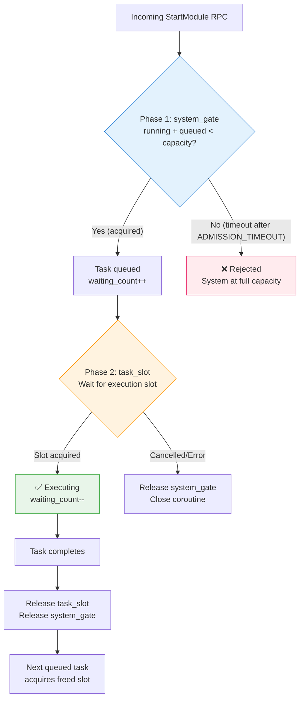

# Concurrency & Admission Control

## Problem Statement

Under burst load, tasks were rejected because the semaphore timeout was too short relative to task duration:

- **3,704 `StartModule` RPCs** arrived in a burst
- **800 concurrent task slots** were configured
- Tasks took **229–245 seconds** each to complete
- The legacy `TASK_WAIT_TIMEOUT` was **30 seconds**
- Result: **~2,100 tasks rejected** — they couldn't acquire a slot within 30s because running tasks held slots for 4+ minutes

The core mismatch: a 30-second timeout waiting for a slot that won't free up for 229 seconds guarantees rejection. Increasing the timeout doesn't help either — it just delays the inevitable and wastes resources on doomed waits.

---

## Two-Phase Admission

When `DIGITALKIN_MAX_QUEUED_TASKS > 0`, the task manager uses a two-phase admission model:



### Phase 1 — System Gate (fast reject)

- **Semaphore size:** `MAX_CONCURRENT_TASKS + MAX_QUEUED_TASKS`
- **Timeout:** `ADMISSION_TIMEOUT` (default 5s)
- **Purpose:** Quickly reject requests when the system is truly overloaded (both running and queued slots full)
- If the gate is full, there's no point waiting — every slot is occupied by a task that will run for minutes

### Phase 2 — Task Slot (patient wait)

- **Semaphore size:** `MAX_CONCURRENT_TASKS`
- **Timeout:** None — waits indefinitely until a slot frees up
- **Purpose:** Once admitted to the system, the task waits patiently for its turn
- Tasks complete in FIFO order (asyncio semaphore fairness)

### Cleanup

Both semaphores are always released when a task completes (success or failure):

```python
finally:
    self._task_slot.release()
    if self._max_queued_tasks > 0:
        self._system_gate.release()
```

---

## Legacy vs Queue Mode

| Aspect | Legacy (`MAX_QUEUED_TASKS=0`) | Queue Mode (`MAX_QUEUED_TASKS>0`) |
|--------|-------------------------------|-----------------------------------|
| Semaphores | 1 (`task_slot` only) | 2 (`system_gate` + `task_slot`) |
| At capacity | Waits `TASK_WAIT_TIMEOUT` (30s), then rejects | Phase 1 fast-rejects if system full; otherwise queues patiently |
| Under burst | Most tasks rejected (timeout << task duration) | Tasks queue and execute as slots free |
| Timeout model | Single timeout for everything | Fast admission timeout + unlimited execution wait |
| Capacity | `MAX_CONCURRENT_TASKS` | `MAX_CONCURRENT_TASKS` + `MAX_QUEUED_TASKS` |
| Config | `DIGITALKIN_TASK_WAIT_TIMEOUT=30` | `DIGITALKIN_ADMISSION_TIMEOUT=5.0` |

---

## Capacity Planning

### Golden Rules

1. **`MAX_CONCURRENT_TASKS` = how many tasks your event loop can handle simultaneously**
   - Each task consumes event loop cycles, gRPC client connections, LLM API calls
   - 200 concurrent tasks with a 3,000 queue outperforms 800 concurrent tasks with no queue
   - Less concurrency → less event loop contention → faster individual tasks → higher sustained throughput

2. **`MAX_QUEUED_TASKS` = your expected burst size minus `MAX_CONCURRENT_TASKS`**
   - If you expect bursts of 3,000 and run 200 concurrently, set queue to 3,000
   - Queued tasks hold an open gRPC stream (cheap HTTP/2) but consume no CPU until they execute

3. **`MAX_CONCURRENT_RPCS >= MAX_CONCURRENT_TASKS + MAX_QUEUED_TASKS`**
   - Otherwise gRPC rejects RPCs at the HTTP/2 layer before the task manager sees them

4. **Keep `ADMISSION_TIMEOUT` short (3–5s)**
   - If the queue is full, waiting longer won't help — it just delays the rejection

### Sizing Example

For 3,704 burst RPCs with 229s average task duration:

```
MAX_CONCURRENT_TASKS = 200    (event loop sweet spot)
MAX_QUEUED_TASKS     = 3600   (absorb the entire burst)
MAX_CONCURRENT_RPCS  = 4000   (≥ 200 + 3600)
ADMISSION_TIMEOUT    = 5.0    (fast reject if truly overloaded)
```

With this config:
- All 3,704 tasks are admitted (200 running + 3,504 queued)
- As each task completes (~229s), the next queued task starts immediately
- Total drain time: `3,704 / 200 × 229s ≈ 70 minutes` (vs. 2,100 failures with legacy mode)

---

## Log Analysis Findings

Analysis of the burst load incident revealed a critical insight about task duration:

| Metric | Value | Notes |
|--------|-------|-------|
| Total task duration | 229–245s | Wall-clock time from start to completion |
| Actual module work | ~88s | Time spent in LLM calls, processing |
| Infrastructure overhead | ~110s | gRPC setup, signal I/O, DNS resolution, CostService contention |
| Overhead ratio | **55%** | More than half the task time was infrastructure |

### Root Causes of Infrastructure Overhead

1. **Event loop saturation at 800 concurrent tasks** — coroutines competing for the event loop caused scheduling delays
2. **DNS timeout waste on unreachable tools** — tools configured in setup but not reachable added ~30s of DNS resolution timeouts per task
3. **CostService contention** — all tasks calling `SendCost` simultaneously created a bottleneck on services-provider

**Takeaway:** Reducing `MAX_CONCURRENT_TASKS` from 800 to 200 and adding a queue eliminates the event loop contention, which reduces the infrastructure overhead and makes individual tasks complete faster.

---

## Environment Variables

| Variable | Default | Description |
|----------|---------|-------------|
| `DIGITALKIN_MAX_CONCURRENT_TASKS` | `100` | Execution slots — how many tasks run simultaneously |
| `DIGITALKIN_MAX_QUEUED_TASKS` | `0` | Queue depth — `0` disables the admission queue (legacy mode) |
| `DIGITALKIN_ADMISSION_TIMEOUT` | `5.0` | Seconds to wait for system gate admission before rejecting |
| `DIGITALKIN_TASK_WAIT_TIMEOUT` | `30` | Legacy: slot wait timeout when queue disabled. Ignored when queue enabled |

---

## Key Files

| Component | File |
|-----------|------|
| `_acquire_task_slot()` (dispatch) | `src/digitalkin/core/task_manager/base_task_manager.py` |
| `_acquire_with_queue()` (two-phase) | `src/digitalkin/core/task_manager/base_task_manager.py` |
| `_acquire_direct()` (legacy) | `src/digitalkin/core/task_manager/base_task_manager.py` |
| `LocalTaskManager.create_task()` | `src/digitalkin/core/task_manager/local_task_manager.py` |
| `SingleJobManager` (sets max_concurrent_tasks) | `src/digitalkin/core/job_manager/single_job_manager.py` |
| `ServerConfig` (MAX_CONCURRENT_RPCS) | `src/digitalkin/grpc_servers/_base_server.py` |

---

## Related Docs

- [Retry & Fault Tolerance](resilience.md) — how failed signals are retried
- [Concurrency Model](concurrency-model.md) — full system view of all three layers
- [gRPC Tuning Guide](../grpc-tuning.md) — recommended configurations per instance size
