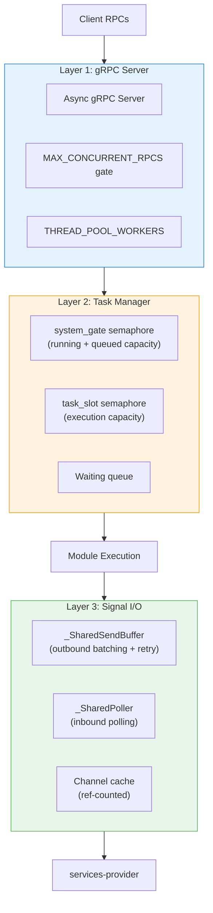
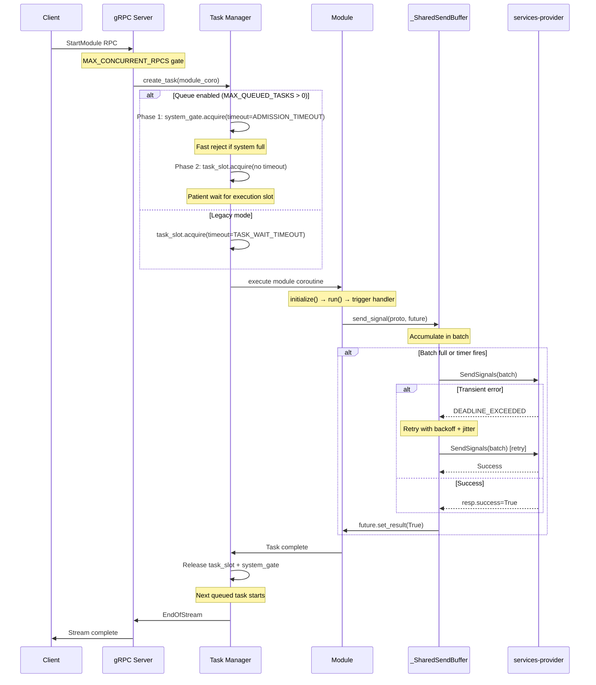

# Concurrency Model

## Three-Layer Architecture

The SDK manages concurrency across three distinct layers, each with its own resource controls:



### Layer 1: gRPC Server (accepts RPCs)

Controls how many RPCs the async server handles concurrently. Each `StartModule` call is a **server-streaming RPC** that stays open for the entire task duration (potentially minutes).

- **`MAX_CONCURRENT_RPCS`** — Front door. Set `>= MAX_CONCURRENT_TASKS + MAX_QUEUED_TASKS`.
- **`THREAD_POOL_WORKERS`** — For synchronous callbacks. Pure-async modules need only 1–2.

### Layer 2: Task Manager (executes work)

Controls how many tasks actually run and how many can wait in line.

- **`system_gate`** — Total admitted tasks (`MAX_CONCURRENT_TASKS + MAX_QUEUED_TASKS`). Fast reject when full.
- **`task_slot`** — Execution slots (`MAX_CONCURRENT_TASKS`). Queued tasks wait here.
- See [Admission Queue](admission-queue.md) for the full two-phase flow.

### Layer 3: Signal I/O (client-side gRPC)

Controls outbound signal batching/retry and inbound signal polling.

- **`_SharedSendBuffer`** — Batches signals, flushes on size or timer, retries on transient errors.
- **`_SharedPoller`** — Polls `GetSignals` with adaptive backoff.
- **Channel cache** — One gRPC channel per (host, port) pair, ref-counted.
- See [Retry & Fault Tolerance](resilience.md) for the retry architecture.

---

## Request Lifecycle



---

## Shared Resources

### _SharedPoller (one per channel)

Polls `GetSignals` for inbound signals with adaptive exponential backoff:

```
Initial interval: SIGNAL_INITIAL_POLL_INTERVAL (0.1s)
  → doubles each empty poll
    → caps at SIGNAL_POLL_INTERVAL (1.0s)
      → resets to initial when signals arrive
```

All tasks sharing a channel share one poller. Signals are dispatched to per-task queues by `job_id`.

### _SharedSendBuffer (one per channel)

Batches outbound signals and flushes them as a single RPC:

```
Signal arrives → append to batch
  → if len(batch) >= MAX_BATCH_SIZE → flush immediately
  → if FLUSH_INTERVAL timer fires → flush whatever is accumulated
    → flush: SendSignals RPC with retry (up to SIGNAL_SEND_RETRIES)
```

### Channel Cache (ref-counted)

gRPC channels are expensive to create (TLS handshake, HTTP/2 negotiation). The SDK caches channels by `(host, port)`:

```
task starts → get_or_create_channel(host, port) → ref_count++
task ends   → release_channel(host, port)       → ref_count--
ref_count == 0 → close channel after grace period
```

Each channel carries its own `_SharedPoller` and `_SharedSendBuffer`.

---

## Event Loop Budget

The asyncio event loop is the single most constrained resource. Every concurrent task competes for it:

| Concurrent Tasks | Event Loop Health | Task Duration | Throughput |
|-----------------|-------------------|---------------|------------|
| 200 | Healthy — coroutines scheduled promptly | ~120s (88s work + 32s overhead) | ~100 tasks/min |
| 400 | Moderate contention — scheduling delays | ~160s | ~150 tasks/min |
| 800 | Saturated — 110s+ overhead per task | ~245s | ~196 tasks/min (but failures) |

**Why 200 outperforms 800:** At 800 concurrent tasks, the event loop spends more time context-switching between coroutines than doing useful work. The infrastructure overhead (DNS resolution, gRPC I/O, CostService calls) balloons from ~32s to ~110s because every async operation waits longer to be scheduled.

**Golden rule:** `MAX_CONCURRENT_TASKS` × average task duration should not exceed what your event loop can schedule without starvation. In practice, 200 concurrent tasks with a queue of 3,000 delivers higher sustained throughput than 800 concurrent tasks with no queue.

---

## Environment Variables by Layer

### Layer 1: gRPC Server

| Variable | Default | Description |
|----------|---------|-------------|
| `DIGITALKIN_MAX_CONCURRENT_RPCS` | `cpu × 200` | Concurrent RPCs accepted |
| `DIGITALKIN_THREAD_POOL_WORKERS` | `min(4, cpu)` | Sync callback thread pool |

### Layer 2: Task Manager

| Variable | Default | Description |
|----------|---------|-------------|
| `DIGITALKIN_MAX_CONCURRENT_TASKS` | `100` | Execution slots |
| `DIGITALKIN_MAX_QUEUED_TASKS` | `0` | Queue depth (0 = legacy mode) |
| `DIGITALKIN_ADMISSION_TIMEOUT` | `5.0` | System gate timeout (seconds) |
| `DIGITALKIN_TASK_WAIT_TIMEOUT` | `30` | Legacy slot timeout (seconds) |

### Layer 3: Signal I/O

| Variable | Default | Description |
|----------|---------|-------------|
| `DIGITALKIN_GRPC_TIMEOUT` | `30` | SendSignals RPC timeout |
| `DIGITALKIN_SIGNAL_MAX_BATCH_SIZE` | `50` | Batch flush trigger |
| `DIGITALKIN_SIGNAL_FLUSH_INTERVAL` | `0.1` | Timer flush trigger (seconds) |
| `DIGITALKIN_SIGNAL_SEND_RETRIES` | `3` | Batch retry attempts |
| `DIGITALKIN_SIGNAL_SEND_BACKOFF_MS` | `100` | Retry backoff base (ms) |
| `DIGITALKIN_POLL_TIMEOUT` | `1` | GetSignals RPC timeout |
| `DIGITALKIN_SIGNAL_POLL_INTERVAL` | `1.0` | Max poll interval (seconds) |
| `DIGITALKIN_SIGNAL_INITIAL_POLL_INTERVAL` | `0.1` | Initial poll interval |
| `DIGITALKIN_SIGNAL_QUEUE_SIZE` | `512` | Per-task signal buffer |

---

## Key Files

| Component | File |
|-----------|------|
| Async gRPC server | `src/digitalkin/grpc_servers/_base_server.py` |
| Server config (MAX_CONCURRENT_RPCS) | `src/digitalkin/grpc_servers/_base_server.py` |
| Module servicer | `src/digitalkin/grpc_servers/module_servicer.py` |
| Task manager (admission queue) | `src/digitalkin/core/task_manager/base_task_manager.py` |
| Local task manager | `src/digitalkin/core/task_manager/local_task_manager.py` |
| Task executor | `src/digitalkin/core/task_manager/task_executor.py` |
| Signal I/O (poller + send buffer) | `src/digitalkin/services/task_manager/grpc_task_manager.py` |
| gRPC client wrapper (exec_grpc_query) | `src/digitalkin/grpc_servers/utils/grpc_client_wrapper.py` |
| Channel/client config models | `src/digitalkin/models/grpc_servers/models.py` |
| Job manager | `src/digitalkin/core/job_manager/single_job_manager.py` |

---

## Related Docs

- [SDK Flow](sdk-flow.md) — request flow from server to module execution
- [Retry & Fault Tolerance](resilience.md) — detailed retry layer documentation
- [Admission Queue](admission-queue.md) — two-phase admission control
- [gRPC Tuning Guide](../grpc-tuning.md) — environment variable reference and recommended configs
