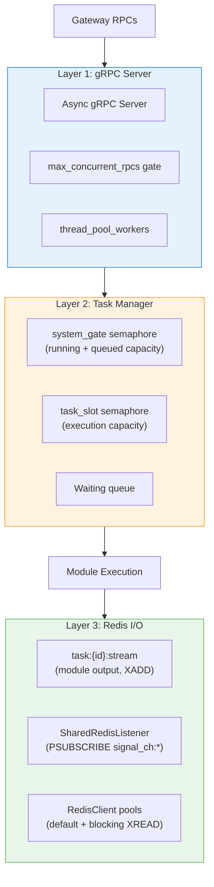
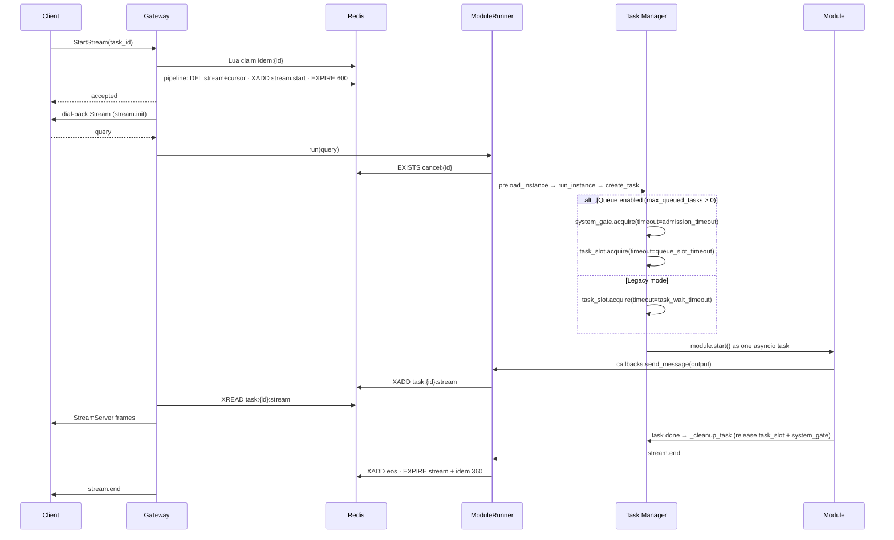

# Concurrency Model

## Three-Layer Architecture

```mermaid
flowchart TB
    subgraph L1["Layer 1: gRPC Server"]
        direction LR
        S1["Async gRPC Server"]
        S2["max_concurrent_rpcs gate"]
        S3["thread_pool_workers"]
    end

    subgraph L2["Layer 2: Task Manager"]
        direction LR
        T1["system_gate semaphore<br/>(running + queued capacity)"]
        T2["task_slot semaphore<br/>(execution capacity)"]
        T3["Waiting queue"]
    end

    subgraph L3["Layer 3: Redis I/O"]
        direction LR
        IO1["task:{id}:stream<br/>(module output, XADD)"]
        IO2["SharedRedisListener<br/>(PSUBSCRIBE signal_ch:*)"]
        IO3["RedisClient pools<br/>(default + blocking XREAD)"]
    end

    CLIENT["Gateway RPCs"] --> L1
    L1 --> L2
    L2 --> EXEC["Module Execution"]
    EXEC --> L3

    style L1 fill:#e3f2fd,stroke:#1976d2
    style L2 fill:#fff3e0,stroke:#ff9800
    style L3 fill:#e8f5e9,stroke:#4caf50
```

### Layer 1: gRPC Server

- **`max_concurrent_rpcs`** — Front door. Keep it `>= max_concurrent_tasks + max_queued_tasks`.
- **`thread_pool_workers`** — For synchronous callbacks. Pure-async modules need only 1–2.

### Layer 2: Task Manager

- **`system_gate`** — Total admitted tasks (`max_concurrent_tasks + max_queued_tasks`). Fast reject when full.
- **`task_slot`** — Execution slots (`max_concurrent_tasks`). Queued tasks wait here.
- Config-setup sessions (`ConfigSetupModule`) are tracked apart from `tasks_sessions` and take no slot.
- See [Admission Queue](admission-queue.md) for the two-phase flow.

### Layer 3: Redis I/O

- **Output** — `ModuleRunner._on_output` XADDs every output to `task:{id}:stream` (bounded by `redis_stream_maxlen`); `stream.end` becomes an `eos` entry plus `EXPIRE`.
- **Signals** — the gateway's `SendSignal` publishes on `signal_ch:{id}`; one `SharedRedisListener` per process PSUBSCRIBEs `signal_ch:*` and calls `task.cancel()` on the owning task. See [Retry & Fault Tolerance](resilience.md).
- **Pools** — `RedisClient` keeps a non-blocking pool and a blocking pool for XREAD.

---

## Request Lifecycle

```mermaid
sequenceDiagram
    participant C as Client
    participant G as Gateway
    participant R as Redis
    participant MR as ModuleRunner
    participant TM as Task Manager
    participant M as Module

    C->>G: StartStream(task_id)
    G->>R: Lua claim idem:{id}
    G->>R: pipeline: DEL stream+cursor · XADD stream.start · EXPIRE 600
    G-->>C: accepted
    G->>C: dial-back Stream (stream.init)
    C-->>G: query
    G->>MR: run(query)
    MR->>R: EXISTS cancel:{id}
    MR->>TM: preload_instance → run_instance → create_task

    alt Queue enabled (max_queued_tasks > 0)
        TM->>TM: system_gate.acquire(timeout=admission_timeout)
        TM->>TM: task_slot.acquire(timeout=queue_slot_timeout)
    else Legacy mode
        TM->>TM: task_slot.acquire(timeout=task_wait_timeout)
    end

    TM->>M: module.start() as one asyncio task
    M->>MR: callbacks.send_message(output)
    MR->>R: XADD task:{id}:stream
    G->>R: XREAD task:{id}:stream
    G->>C: StreamServer frames

    M->>TM: task done → _cleanup_task (release task_slot + system_gate)
    M->>MR: stream.end
    MR->>R: XADD eos · EXPIRE stream + idem 360
    G->>C: stream.end
```

---

## Shared Resources

### SharedRedisListener (one per process)

- PSUBSCRIBEs `signal_ch:*` once; tasks register on start and unregister when they finish.
- Only the first `cancel`/`stop` for a task lands; repeats are dropped.
- Ref-counted: released by `SingleJobManager.stop()` at shutdown.

### Channel cache (ref-counted)

Outbound gRPC channels are cached by target; each communication instance acquires a target once and releases it on close.

---

## Shutdown

`ModuleServer.stop_async` runs in this order:

1. Stop accepting RPCs (health NOT_SERVING, deregister, server stop within `grace`).
2. `job_manager.stop()` — cancel every running task (each emits `stream.cancelled` + `stream.end`), then release the `SharedRedisListener`.
3. `gateway.stop()`.
4. Close the Redis clients.
5. Close the channels.

---

## Event Loop Budget

The asyncio event loop is the most constrained resource. Every concurrent task competes for it:

| Concurrent Tasks | Event Loop Health | Task Duration | Throughput |
|-----------------|-------------------|---------------|------------|
| 200 | Healthy — coroutines scheduled promptly | ~120s (88s work + 32s overhead) | ~100 tasks/min |
| 400 | Moderate contention — scheduling delays | ~160s | ~150 tasks/min |
| 800 | Saturated — 110s+ overhead per task | ~245s | ~196 tasks/min (but failures) |

`max_concurrent_tasks` × average task duration should not exceed what the event loop can schedule without starvation. 200 concurrent tasks with a deep queue sustains more throughput than 800 concurrent tasks with none.

---

## Environment Variables by Layer

### Layer 1: gRPC Server

| Variable | Default | Description |
|----------|---------|-------------|
| `SERVER_MAX_CONCURRENT_RPCS` | `cpu × 200` | Concurrent RPCs accepted |
| `SERVER_THREAD_POOL_WORKERS` | `min(4, cpu)` | Sync callback thread pool |

### Layer 2: Task Manager

| Variable | Default | Description |
|----------|---------|-------------|
| `DIGITALKIN_TASK_MANAGER_MAX_CONCURRENT_TASKS` | `500` | Execution slots |
| `DIGITALKIN_TASK_MANAGER_MAX_QUEUED_TASKS` | `5000` | Queue depth (0 = legacy mode) |
| `DIGITALKIN_TASK_MANAGER_ADMISSION_TIMEOUT` | `5.0` | System gate timeout (seconds) |
| `DIGITALKIN_TASK_MANAGER_QUEUE_SLOT_TIMEOUT` | `600` | Max wait in the queue (seconds) |
| `DIGITALKIN_TASK_MANAGER_TASK_WAIT_TIMEOUT` | `30` | Legacy slot timeout (seconds) |

### Layer 3: Redis I/O

| Variable | Default | Description |
|----------|---------|-------------|
| `DIGITALKIN_REDIS_URL` | `redis://localhost:6379/0` | Redis connection URL |
| `DIGITALKIN_REDIS_POOL_SIZE` | `2000` | Total pool size (split default/blocking) |
| `DIGITALKIN_REDIS_IDEM_TTL` | `3600` | `idem:{id}` TTL before EOS |
| `DIGITALKIN_SIGNAL_MAX_TASKS` | `10000` | Max tasks registered on the listener |
| `DIGITALKIN_GATEWAY_STREAM_REDIS_STREAM_INITIAL_TTL` | `600` | Stream + `cancel:{id}` TTL before EOS |
| `DIGITALKIN_GATEWAY_STREAM_REDIS_STREAM_TTL` | `360` | Stream + `idem:{id}` TTL after EOS |
| `DIGITALKIN_GATEWAY_STREAM_REDIS_STREAM_MAXLEN` | `1000` | Approximate stream length cap |

---

## Key Files

| Component | File |
|-----------|------|
| Async gRPC server | `src/digitalkin/grpc_servers/_base_server.py` |
| Module server (shutdown order) | `src/digitalkin/grpc_servers/module_server.py` |
| Gateway (StartStream, Stream, SendSignal) | `src/digitalkin/grpc_servers/gateway_servicer.py` |
| Module runner | `src/digitalkin/core/task_manager/module_runner.py` |
| Task manager (admission queue) | `src/digitalkin/core/task_manager/base_task_manager.py` |
| Task executor | `src/digitalkin/core/task_manager/task_executor.py` |
| Signal listener | `src/digitalkin/core/task_manager/redis/redis_signal.py` |
| Job manager | `src/digitalkin/core/job_manager/single_job_manager.py` |

---

## Related Docs

- [SDK Flow](sdk-flow.md) — request flow from server to module execution
- [Retry & Fault Tolerance](resilience.md) — retry layers and the signal path
- [Admission Queue](admission-queue.md) — two-phase admission control
- [gRPC Tuning Guide](../grpc-tuning.md) — environment variable reference and recommended configs
