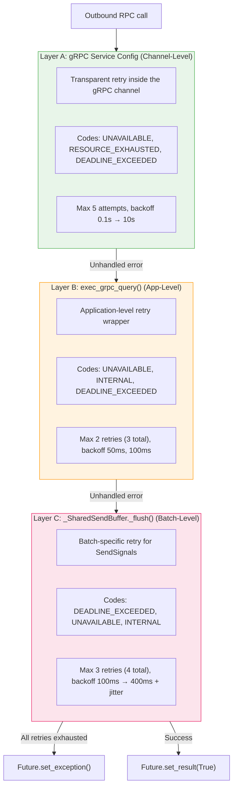
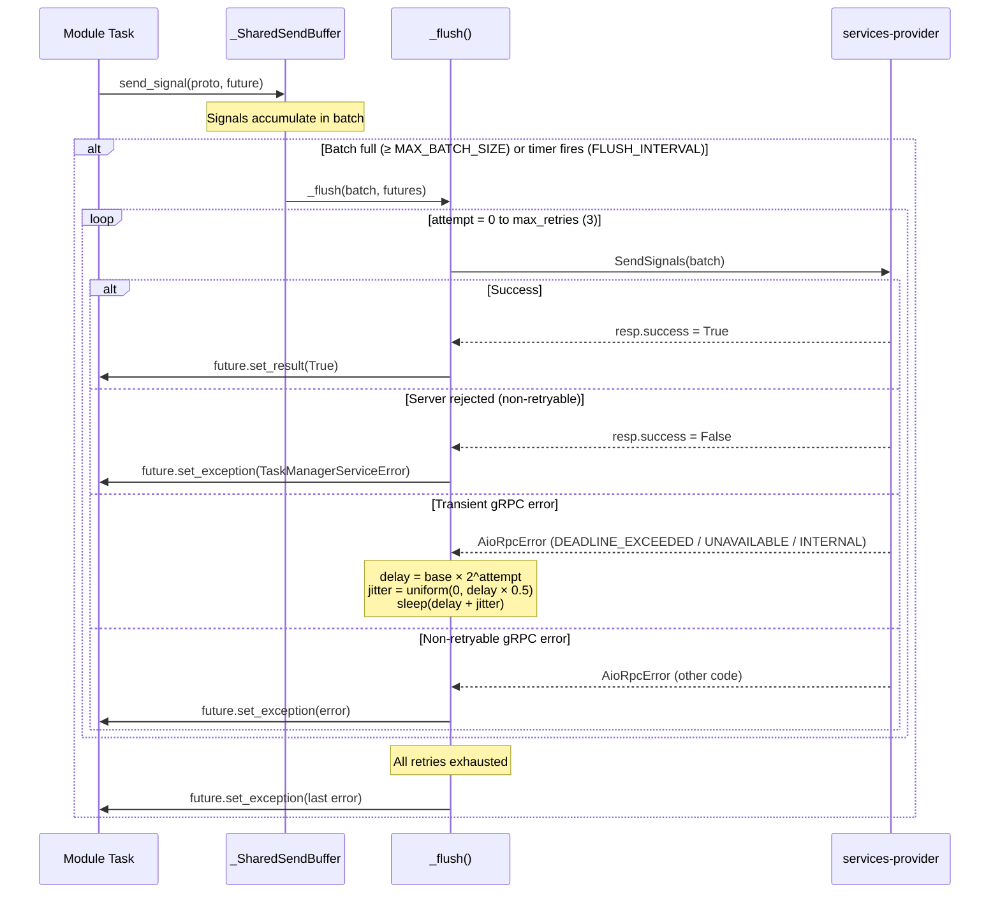

# Retry & Fault Tolerance

## Problem Statement

Under burst load, a single failed `SendSignals` RPC would kill entire task batches. In the observed incident:

- **92 concurrent StartModule calls** arrived simultaneously
- The first `SendSignals` batch (50 signals) took **17 seconds** to get a response from services-provider
- The second batch (40 signals) hit the **30-second `DEADLINE_EXCEEDED`** timeout
- All 40 futures in that batch received the exception
- The `signal_wrapper` coroutine died, the supervisor marked every associated job as **FAILED**
- A single transient timeout cascaded into total task failure

The root cause: `_flush()` had **no retry logic** — one failed RPC meant permanent data loss for every signal in the batch.

---

## Three Retry Layers

The SDK now has three independent retry layers, each catching errors at a different level:



**How they compose:**
- Layer A retries transparently inside the gRPC channel — the caller never sees retried errors.
- Layer B wraps individual RPC calls at the application level, catching errors that Layer A didn't handle.
- Layer C is specific to the batched `SendSignals` path, adding batch-aware retry with jitter to prevent thundering herd.

---

## SendSignals Retry Flow



---

## Retryable vs Non-Retryable Errors

| Error Type | Retried? | Rationale |
|-----------|----------|-----------|
| `DEADLINE_EXCEEDED` | Yes | Transient — services-provider was slow but may recover |
| `UNAVAILABLE` | Yes | Transient — network blip, connection reset, DNS flap |
| `INTERNAL` | Yes | Transient — server-side panic or temporary error |
| `INVALID_ARGUMENT` | No | Permanent — bad request payload won't fix itself |
| `NOT_FOUND` | No | Permanent — resource doesn't exist |
| `PERMISSION_DENIED` | No | Permanent — auth issue |
| `resp.success = False` | No | Server explicitly rejected the batch (breaks retry loop) |
| Non-gRPC exception | No | Unexpected error (serialization, etc.) |

---

## Environment Variables

| Variable | Default | Description |
|----------|---------|-------------|
| `DIGITALKIN_SIGNAL_SEND_RETRIES` | `3` | Number of retry attempts after the initial try (4 total attempts) |
| `DIGITALKIN_SIGNAL_SEND_BACKOFF_MS` | `100` | Base backoff in milliseconds. Doubles each attempt: 100ms → 200ms → 400ms |
| `DIGITALKIN_GRPC_TIMEOUT` | `30` | Per-RPC timeout in seconds for `SendSignals`. Under burst load, consider increasing to 60s |
| `DIGITALKIN_SIGNAL_MAX_BATCH_SIZE` | `50` | Signals per batch. Larger = fewer RPCs but higher per-signal latency |
| `DIGITALKIN_SIGNAL_FLUSH_INTERVAL` | `0.1` | Timer flush trigger in seconds. Lower = less latency, higher = more batching |

---

## Before / After

### Before: Single Attempt

```
_flush() called with 40 signals
  → SendSignals RPC
    → DEADLINE_EXCEEDED after 30s
      → All 40 futures: set_exception(AioRpcError)
        → signal_wrapper dies
          → Supervisor marks all tasks FAILED
```

**Impact:** One slow response from services-provider kills the entire batch permanently.

### After: Retry with Exponential Backoff + Jitter

```
_flush() called with 40 signals
  → Attempt 1: SendSignals RPC
    → DEADLINE_EXCEEDED after 30s
    → Backoff: 100ms + jitter(0-50ms)

  → Attempt 2: SendSignals RPC
    → DEADLINE_EXCEEDED after 30s
    → Backoff: 200ms + jitter(0-100ms)

  → Attempt 3: SendSignals RPC
    → Success
      → All 40 futures: set_result(True)
```

**Impact:** Transient failures are absorbed. The jitter prevents all concurrent buffers from retrying at the same instant (thundering herd). Only permanent failures propagate to tasks.

---

## Key Files

| Component | File |
|-----------|------|
| `_SharedSendBuffer._flush()` with retry | `src/digitalkin/services/task_manager/grpc_task_manager.py` |
| `exec_grpc_query()` app-level retry | `src/digitalkin/grpc_servers/utils/grpc_client_wrapper.py` |
| `RetryPolicy` (channel-level config) | `src/digitalkin/models/grpc_servers/models.py` |
| `ClientConfig` (channel options) | `src/digitalkin/grpc_servers/utils/models.py` |
| `_SharedPoller` (inbound signals) | `src/digitalkin/services/task_manager/grpc_task_manager.py` |

---

## Related Docs

- [Admission Queue](admission-queue.md) — how tasks are queued instead of rejected under load
- [Concurrency Model](concurrency-model.md) — full system view of all three layers
- [gRPC Tuning Guide](../grpc-tuning.md) — environment variable reference and recommended configs
