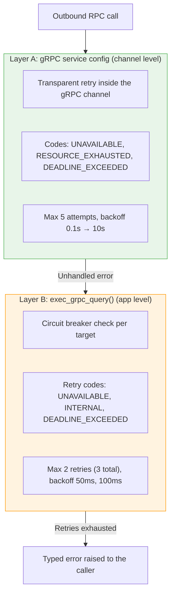
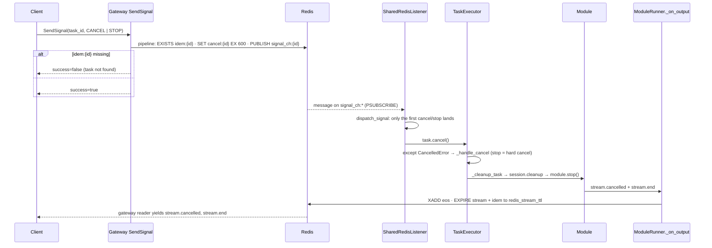

# Retry & Fault Tolerance

Signals and module output travel through Redis; outbound service calls (registry, storage, cost, setup, …) travel over gRPC. Each path has its own failure handling.

---

## gRPC service calls: two retry layers

```mermaid
flowchart TB
    subgraph LayerA["Layer A: gRPC service config (channel level)"]
        A1["Transparent retry inside the gRPC channel"]
        A2["Codes: UNAVAILABLE, RESOURCE_EXHAUSTED, DEADLINE_EXCEEDED"]
        A3["Max 5 attempts, backoff 0.1s → 10s"]
    end

    subgraph LayerB["Layer B: exec_grpc_query() (app level)"]
        B1["Circuit breaker check per target"]
        B2["Retry codes: UNAVAILABLE, INTERNAL, DEADLINE_EXCEEDED"]
        B3["Max 2 retries (3 total), backoff 50ms, 100ms"]
    end

    RPC["Outbound RPC call"] --> LayerA
    LayerA -->|"Unhandled error"| LayerB
    LayerB -->|"Retries exhausted"| FAIL["Typed error raised to the caller"]

    style LayerA fill:#e8f5e9,stroke:#4caf50
    style LayerB fill:#fff3e0,stroke:#ff9800
```

- Layer A retries inside the channel; the caller never sees the retried errors.
- Layer B wraps each unary call in `exec_grpc_query()`: it checks the per-target circuit breaker, retries transient codes with exponential backoff, and records failures (`UNKNOWN` and `RESOURCE_EXHAUSTED` also count toward opening the circuit).

| Error | Retried by Layer B? |
|-------|---------------------|
| `DEADLINE_EXCEEDED`, `UNAVAILABLE`, `INTERNAL` | Yes |
| `INVALID_ARGUMENT`, `NOT_FOUND`, `PERMISSION_DENIED`, other codes | No |

---

## Signals: Redis pub/sub, no retry buffer

A cancel/stop is one Redis pipeline issued by the gateway's `SendSignal`; there is no client-side send buffer or poller.

```mermaid
sequenceDiagram
    participant C as Client
    participant G as Gateway SendSignal
    participant R as Redis
    participant L as SharedRedisListener
    participant E as TaskExecutor
    participant M as Module
    participant W as ModuleRunner._on_output

    C->>G: SendSignal(task_id, CANCEL | STOP)
    G->>R: pipeline: EXISTS idem:{id} · SET cancel:{id} EX 600 · PUBLISH signal_ch:{id}
    alt idem:{id} missing
        G-->>C: success=false (task not found)
    else
        G-->>C: success=true
    end
    R-->>L: message on signal_ch:* (PSUBSCRIBE)
    L->>L: dispatch_signal: only the first cancel/stop lands
    L->>E: task.cancel()
    E->>E: except CancelledError → _handle_cancel (stop = hard cancel)
    E->>M: _cleanup_task → session.cleanup → module.stop()
    M->>W: stream.cancelled + stream.end
    W->>R: XADD eos · EXPIRE stream + idem to redis_stream_ttl
    R-->>C: gateway reader yields stream.cancelled, stream.end
```

A cancel published before the task registers with the listener is not lost: `ModuleRunner` checks the `cancel:{id}` tombstone before `preload_instance`, after it, and right after `run_instance`. On a hit it writes `stream.cancelled` + `stream.end` (or stops the preloaded instance, or cancels the just-registered task).

If Redis is unreachable, `SendSignal` answers `success=false` and the client retries.

---

## Failure paths on the task

| Failure | Outcome |
|---------|---------|
| Dial-back fails before the module runner spawns | `stream.error(fatal)` + EOS written, then `idem:{id}` released so the task can be started again |
| Setup/input validation, capacity, runtime error in `ModuleRunner` | `stream.error(fatal)` + EOS; a preloaded instance whose task was never created is stopped and its context cleaned up |
| `ModuleRunner` cancelled before the task is created | `stream.error(MODULE_RUNTIME_ERROR)` + EOS, instance cleaned up, cancellation re-raised |
| Producer dies without EOS | Consumer read gives up after `read_idle_timeout_s` with `STREAM_IDLE_TIMEOUT` |
| Cancel lands during cleanup | `_cleanup_task` runs shielded, finishes, then re-raises |

---

## Environment Variables

| Variable | Default | Description |
|----------|---------|-------------|
| `DIGITALKIN_GRPC_QUERY_MAX_RETRIES` | `2` | Layer B retries after the first attempt |
| `DIGITALKIN_GRPC_QUERY_BACKOFF_BASE_MS` | `50` | Layer B base backoff; doubles each attempt |
| `DIGITALKIN_GRPC_QUERY_TIMEOUT` | `30` | Default per-query deadline (seconds) |
| `DIGITALKIN_GRPC_RETRY_MAX_ATTEMPTS` | `5` | Layer A attempts including the original call |
| `DIGITALKIN_GRPC_RETRY_INITIAL_BACKOFF` / `_MAX_BACKOFF` | `0.1s` / `10s` | Layer A backoff bounds |
| `DIGITALKIN_CB_FAIL_MAX` | `5` | Consecutive failures before the circuit opens |
| `DIGITALKIN_CB_RESET_TIMEOUT` | `30` | Seconds before a half-open probe |

---

## Key Files

| Component | File |
|-----------|------|
| `exec_grpc_query()` retry + circuit breaker | `src/digitalkin/grpc_servers/utils/grpc_client_wrapper.py` |
| Circuit breaker | `src/digitalkin/grpc_servers/utils/circuit_breaker.py` |
| `RetryPolicy` (channel-level config) | `src/digitalkin/models/grpc_servers/models.py` |
| Gateway `SendSignal` | `src/digitalkin/grpc_servers/gateway_servicer.py` |
| Signal listener | `src/digitalkin/core/task_manager/redis/redis_signal.py` |
| Tombstone checks, EOS write | `src/digitalkin/core/task_manager/module_runner.py` |

---

## Related Docs

- [Admission Queue](admission-queue.md) — how tasks are queued instead of rejected under load
- [Concurrency Model](concurrency-model.md) — full system view
- [gRPC Tuning Guide](../grpc-tuning.md) — environment variable reference and recommended configs
