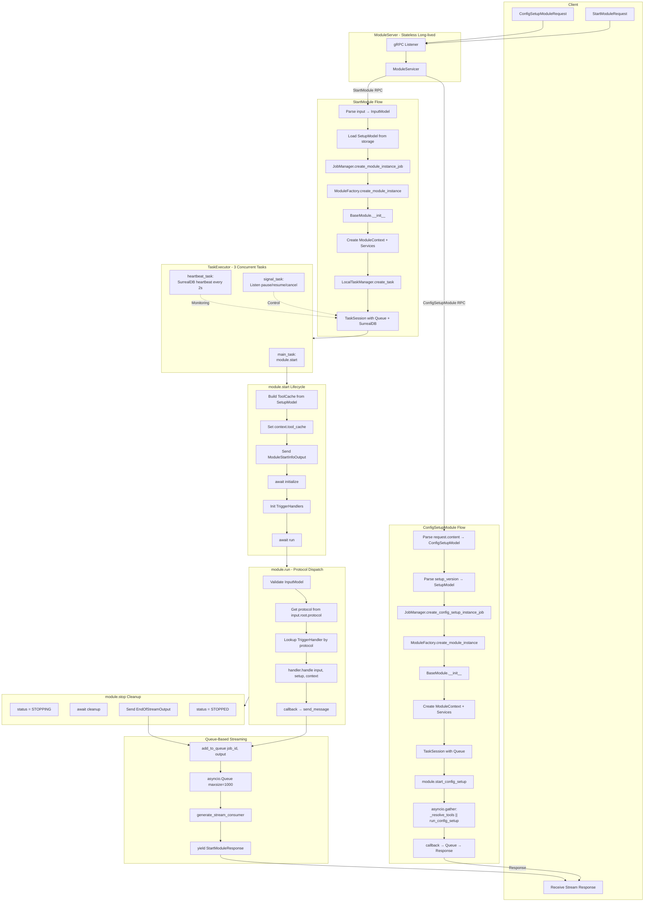

# SDK Flow: Server to Module Execution

## Architecture Stateless

```
┌─────────────────────────────────────────────────────────────────────┐
│                    ModuleServer (Long-lived)                         │
│  - Listens to gRPC continuously                                      │
│  - Stores NO state between requests                                  │
│  - Each request = new module instance                                │
└─────────────────────────────────────────────────────────────────────┘
                              │
                              ▼
┌─────────────────────────────────────────────────────────────────────┐
│                    Per-Request (Ephemeral)                           │
│  ┌──────────────┐  ┌──────────────┐  ┌──────────────┐              │
│  │   job_id     │  │   Module     │  │ TaskSession  │              │
│  │   (uuid)     │  │   Instance   │  │   + Queue    │              │
│  └──────────────┘  └──────────────┘  └──────────────┘              │
│         │                 │                  │                       │
│         └────────────────┼──────────────────┘                       │
│                          │                                           │
│                     Destroyed after execution                       │
└─────────────────────────────────────────────────────────────────────┘
```

---

## Flow Diagram



---

## Two Main Flows

| Step | ConfigSetupModule | StartModule |
|------|-------------------|-------------|
| 1 | Parse ConfigSetupModel | Parse InputModel |
| 2 | Parse SetupModel (config fields) | Load SetupModel from storage |
| 3 | Create Module Instance | Create Module Instance |
| 4 | `start_config_setup()` | `create_task()` with 3 concurrent tasks |
| 5 | `_resolve_tools()` + `run_config_setup()` in parallel | `module.start()` → `run()` → TriggerHandler |
| 6 | Return updated SetupModel | Stream outputs via Queue |

---

## ConfigSetupModule Flow Detail

```
Client sends ConfigSetupModuleRequest
    │
    ▼
ModuleServicer.ConfigSetupModule()
    │
    ├─ Parse request.content → ConfigSetupModel
    ├─ Parse request.setup_version.content → SetupModel (config_fields=True)
    │
    ▼
JobManager.create_config_setup_instance_job()
    │
    ├─ job_id = uuid.uuid4()
    │
    ├─ module = ModuleFactory.create_module_instance()
    │       │
    │       └─ BaseModule.__init__()
    │           ├─ status = CREATED
    │           └─ context = ModuleContext(services, session, callbacks)
    │
    ├─ TaskSession(job_id, queue)
    │
    └─ module.start_config_setup(config_setup_data, callback)
            │
            ├─ status = RUNNING
            │
            └─ asyncio.gather(
                   _resolve_tools(config_setup_data),
                   run_config_setup(context, config_setup_data)
               )
               │
               └─ callback(setup_model) → Queue → Response
```

---

## StartModule Flow Detail

```
Client sends StartModuleRequest
    │
    ▼
ModuleServicer.StartModule()
    │
    ├─ input_data = parse InputModel
    ├─ setup_data = load from SetupStrategy
    │
    ▼
JobManager.create_module_instance_job()
    │
    ├─ job_id = uuid.uuid4()
    │
    ├─ module = ModuleFactory.create_module_instance()
    │
    ▼
LocalTaskManager.create_task()
    │
    ├─ TaskSession(job_id, queue, SurrealDB connection)
    │
    └─ TaskExecutor.execute_task()
            │
            ├─ main_task: module.start(input_data, setup_data, callback)
            ├─ heartbeat_task: session.generate_heartbeats()
            └─ signal_task: session.listen_signals()
```

---

## module.start() Lifecycle

```
BaseModule.start(input_data, setup_data, callback)
    │
    ├─ context.callbacks.send_message = callback
    │
    ├─ tool_cache = setup_data.build_tool_cache()
    ├─ context.tool_cache = tool_cache
    │
    ├─ callback(ModuleStartInfoOutput)  ──→ Queue
    │
    ├─ await initialize(context, setup_data)
    │
    ├─ triggers_discoverer.init_handlers(context)
    │
    ├─ await run(input_data, setup_data)
    │       │
    │       ├─ handler = get_trigger(input.root.protocol)
    │       └─ handler.handle(input, setup, context)
    │               │
    │               └─ send_message(output) ──→ Queue
    │
    └─ await stop()
            │
            ├─ await cleanup()
            └─ callback(EndOfStreamOutput) ──→ Queue
```

---

## Protocol-Based Dispatch

```
InputModel
    │
    └─ root: DataTrigger
           │
           └─ protocol: str  ←── "message", "file", "healthcheck_ping", etc.
                   │
                   ▼
           TriggerHandler lookup by protocol
                   │
                   ▼
           handler.handle(input, setup, context)
```

---

## Queue-Based Streaming

```
TriggerHandler.handle()
    │
    └─ await send_message(output)
            │
            ▼
       callback(output)
            │
            ▼
       add_to_queue(job_id, output)
            │
            ▼
       session.queue.put(output.model_dump())
            │
            ▼
       ┌─────────────────────────────────┐
       │  asyncio.Queue (maxsize=1000)   │
       └─────────────────────────────────┘
            │
            ▼
       generate_stream_consumer(job_id)
            │
            ▼
       yield StartModuleResponse(output)
            │
            ▼
       Client receives streamed response
```

---

## IDs Flow

```
Client provides:
    ├─ mission_id
    ├─ setup_id
    └─ setup_version_id

Server generates:
    └─ job_id = uuid.uuid4()  (unique per request)

All IDs stored in:
    └─ ModuleContext.session
            │
            ├─ Used in structured logging
            ├─ Used in SurrealDB records
            └─ Returned in responses
```

---

## Key Files

| Component | File |
|-----------|------|
| Server | `src/digitalkin/grpc_servers/module_server.py` |
| Servicer | `src/digitalkin/grpc_servers/module_servicer.py` |
| Module Base | `src/digitalkin/modules/_base_module.py` |
| Job Manager | `src/digitalkin/core/job_manager/single_job_manager.py` |
| Task Manager | `src/digitalkin/core/task_manager/local_task_manager.py` |
| Task Session | `src/digitalkin/core/task_manager/task_session.py` |
| Task Executor | `src/digitalkin/core/task_manager/task_executor.py` |
| Factories | `src/digitalkin/core/common/factories.py` |
| Trigger Handler | `src/digitalkin/modules/trigger_handler.py` |
