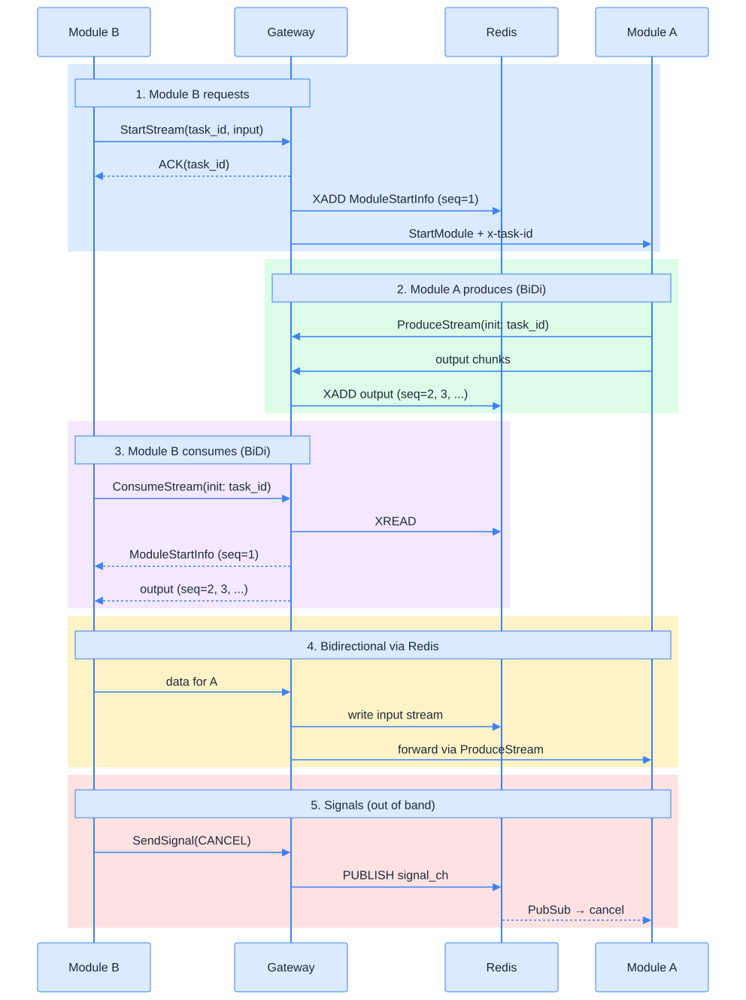
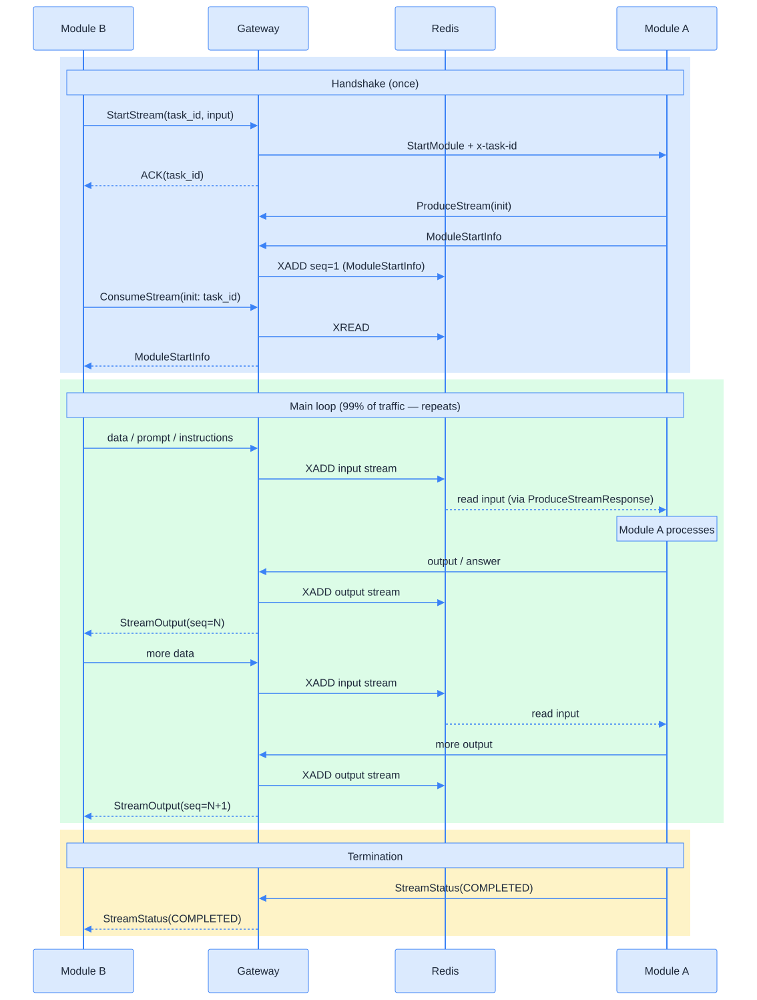
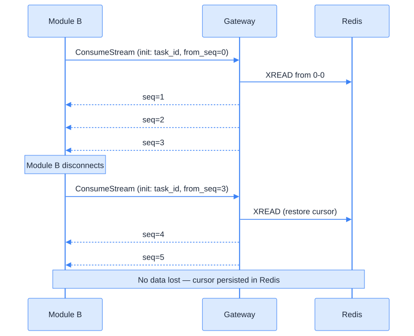
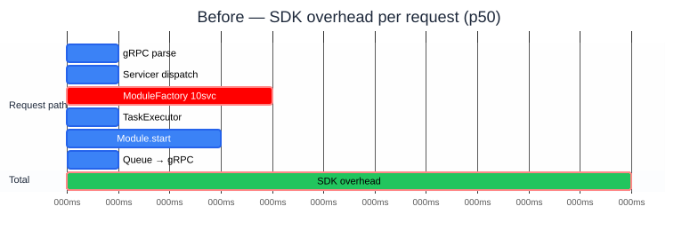
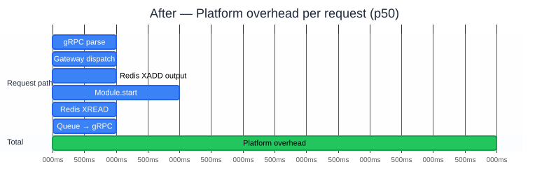
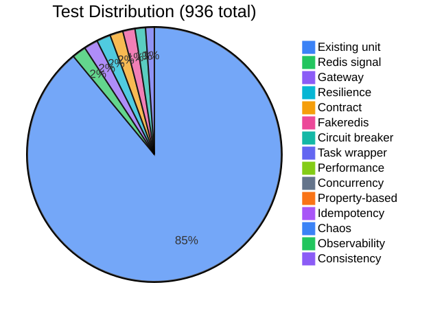

# DigitalKin SDK v1.0.0
## Target Architecture — From Library to Platform

**17 new files** · **948 tests** · **4 proto RPCs** · **9 Redis key patterns**

---

## What changed — and why

The SDK was a **library**: `pip install`, subclass `BaseModule`, run.
Now it's a **platform**: Gateway + Redis + Resilience.

> **Why**: process crash = total state loss. No reconnection. No signal forwarding. No M2M brokering. No capacity management.

---

## Architecture overview



---

## The four Gateway RPCs

| RPC | Type | Direction | Purpose |
|-----|------|-----------|---------|
| `StartStream` | unary | B → GW | Request execution. ACK + task_id. GW injects ModuleStartInfo. |
| `ProduceStream` | **BiDi** | A → GW | Module A output → Redis. GW forwards B's data → A. |
| `ConsumeStream` | **BiDi** | B → GW | Module B reads from Redis. B sends data → Redis → A. |
| `SendSignal` | unary | B → GW | Cancel/pause via Redis pub/sub (out of band). |

**Key**: modules are **isolated** — they only talk to Gateway + Redis. Gateway injects ModuleStartInfo as seq=1.

---

## M2M communication — the core loop

**Handshake** (happens once per task):

1. **Module B** → `StartStream(task_id)` → Gateway starts A → **ACK**
2. **Module A** → `ProduceStream(BiDi)` → Gateway → **first msg = ModuleStartInfo** → Redis (seq=1)
3. **Module B** → `ConsumeStream(BiDi)` → Gateway → reads Redis → gets **ModuleStartInfo**

**Main loop** (99% of the time — repeats until done):

4. **Module B sends data** (prompt, context, instructions) → Gateway → Redis → Module A
5. **Module A processes** and **responds** with output → Gateway → Redis → Module B
6. **Repeat 4-5** — B asks, A answers. This is the conversation.

**Termination**: Module A sends completion status, or Module B sends `SendSignal(CANCEL)`.

> Modules are **fully isolated**. They only see Gateway + Redis. Never each other.

---

## The main loop in detail

```
         Module B                Gateway              Redis                Module A
            │                      │                    │                      │
  ┌─────────┤                      │                    │                      │
  │ REPEAT  │                      │                    │                      │
  │         ├── data/prompt ──────►│                    │                      │
  │         │                      ├── XADD input ────►│                      │
  │         │                      │                    │──── read input ─────►│
  │         │                      │                    │                      │
  │         │                      │                    │       (A processes)  │
  │         │                      │                    │                      │
  │         │                      │                    │◄── output chunk ─────┤
  │         │                      │◄── XADD output ───│                      │
  │         │◄── StreamOutput ─────┤                    │                      │
  └─────────┤                      │                    │                      │
            │                      │                    │                      │
```

> This is **99% of traffic**. B asks, A answers. Everything else is handshake or cleanup.

---

## Request flow — full sequence



---

## Signal path — batched, no new channels



**Batching**: 50 signals OR 100ms (±10% jitter) → 1 pipeline
**Dedup**: identical JSON payloads skipped
**Priority**: stop/cancel evict oldest on QueueFull

---

## Redis key patterns


---

## Reconnection via `from_seq`



---

## Circuit breaker — fail fast



**Where**: `exec_grpc_query()`
Every outbound gRPC call.

**Cleanup**: `remove()` on channel close. `clear_all()` on shutdown.

**Backoff**: 10ms base, 2 retries → 30ms worst case.

---

## Resilience stack

| Component | What | Trigger | Recovery |
|-----------|------|---------|----------|
| **CircuitBreaker** | Per-service fail-fast | 5 consecutive failures | 30s → probe |
| **WatchdogThread** | Loop stall detection | 5s no progress | SIGTERM → SIGKILL |
| **Bulkhead** | Concurrency limit | Semaphore full (50) | BulkheadFullError |
| **SessionReaper** | Zombie cleanup | 300s idle | Force cleanup |
| **GracefulShutdown** | Sequenced exit | SIGTERM | Checkpoint → cancel |
| **StartupRestorer** | Recovery | Process start | Scan checkpoints |

---

## Latency — before (SDK v0.3)



**~11ms** SDK overhead per request (p50, no tools, idle).
Bottleneck: `ModuleFactory` initializes 10 service strategies per job (~4ms).

---

## Latency — after (SDK v1.0)



**~7ms** platform overhead per request (p50, idle).
No per-job service init (pool reuse). Redis adds ~2ms but enables reconnection + durability.

---

## What got faster

| Stage | Before | After | Why |
|-------|--------|-------|-----|
| Utility protocol | 10-60ms | **< 5ms** | Gateway handles inline, no job creation |
| Signal delivery | ~5ms | **~2ms** | `RedisSendBuffer` batches 50 signals into 1 pipeline |
| gRPC retry | 150ms | **30ms** | Backoff base 50→10ms, circuit breaker covers cascade |
| Consumer polling | 1000ms | **250ms** | Queue timeout reduced, faster shutdown detection |

---

## What got slower — and why it's worth it

| New cost | How much | Why it exists | Mitigation |
|----------|----------|---------------|------------|
| **+1ms per state transition** | 6 transitions × ~1ms = **~6ms per task lifecycle** | Every `session.status = "running"` writes to Redis **before** memory (P1 invariant). If process crashes after Redis write, state is recoverable. | `HSET + EXPIRE` pipelined in 1 round-trip (was 2). Fire-and-forget via tracked asyncio.Task. |
| **+1ms per output chunk** | ~1ms per XADD | Module A's output persisted to Redis Stream for durability + reconnection. Without this, process crash = lost tokens. | `RedisStreamBatchWriter` flushes 20 items in 1 pipeline (50ms window). |
| **+1ms per XREAD** | ~1ms per batch read | Module B reads from Redis Stream (not in-memory queue). Enables `from_seq` reconnection — client disconnects, reconnects, no data lost. | Batched: 50 entries per XREAD call. Cursor persisted for recovery. |
| **+0.5ms per heartbeat** | every 500ms idle | Gateway sends heartbeat to Module B during idle periods to detect stale connections. | Was 2000ms — reduced to 500ms for faster detection. |

---

## Memory guardrails



---

## Cleanup chain



---

## Tradeoffs — what we gained

| What | Value |
|------|-------|
| Crash recovery | Redis checkpoints survive process restart |
| Reconnection | `from_seq` on ConsumeStream — no data loss |
| Fail fast | Circuit breaker — no 30s timeout on dead services |
| Module isolation | A ↔ Redis ↔ Gateway ↔ Redis ↔ B — never direct |
| Signal forwarding | Client cancel reaches module in ~1ms via pub/sub |
| Capacity management | 2200 stream cap, zombie reaper, bulkhead |
| Event loop protection | WatchdogThread kills stalled process in 5s |
| Idempotency | Lua atomic claims prevent duplicate execution |

---

## Tradeoffs — what we lost

| What | Cost | Why worth it | Mitigation |
|------|------|-------------|------------|
| **Redis SPOF** | Full degradation if Redis down | Durability, reconnection, isolation | Fallback to in-memory if `redis_client=None` |
| **+6ms per lifecycle** | 6 status writes × ~1ms each | Crash recovery — state survives restart | Pipelined HSET+EXPIRE (1 RTT, not 2) |
| **+1ms per chunk** | XADD per output | Reconnection via `from_seq` | BatchWriter: 20 items per pipeline |
| **+1ms per read** | XREAD per batch | Durable delivery to Module B | 50 entries per XREAD call |
| **Gateway hop** | +0.5ms per message | Full module isolation + signals | Required — modules never see each other |
| **Bounded queues** | Items dropped when full | Prevents OOM under load | Configurable: BLOCK/DROP_OLDEST/REJECT |

---

## Design decisions

| Decision | Why | Rejected |
|----------|-----|----------|
| ProduceStream (A) + ConsumeStream (B) | Separate BiDi per role — clean isolation | Single BiDi mixes directions |
| Gateway injects ModuleStartInfo | Decouples A from start info format | A producing it couples protocol |
| RedisStreamBatchWriter | 20 items or 50ms per pipeline flush | Per-item XADD wastes RTTs |
| Session state in Redis | Enables Gateway horizontal scaling | In-memory = single instance |
| `task_id` from client | Universal key: Redis, signals, metrics | Server-minted splits references |
| Redis in `core/` | Infrastructure, not strategy | `RedisTaskManager` was wrong |
| 10ms retry base | CB already covers cascade | 150ms too slow with CB |
| Jitter on flush | Prevents thundering herd | Fixed interval synchronizes |

---

## Test coverage



**936 total**
- 134 new tests
- 10 test categories
- 14 pytest markers

---

## Test markers

```bash
uv run pytest -m property       # Hypothesis
uv run pytest -m concurrency    # Race conditions
uv run pytest -m chaos          # Fault injection
uv run pytest -m idempotency    # Duplicate handling
uv run pytest -m contract       # Proto shapes
uv run pytest -m stress         # Latency budgets
uv run pytest tests/core/redis/ # Fakeredis
uv run pytest tests/gateway/    # Gateway
uv run pytest tests/advanced/   # All advanced
```

---

## File structure

```
src/digitalkin/
├── core/
│   ├── task_manager/redis/        Infrastructure
│   │   ├── redis_client.py        Ref-counted pool
│   │   ├── redis_signal.py        Listener + SendBuffer
│   │   ├── redis_state.py         Lifecycle state
│   │   ├── redis_streams.py       XADD + XREAD + cursor
│   │   ├── redis_checkpoint.py    Checkpoint + index
│   │   └── redis_idempotency.py   Lua atomic claims
│   ├── task_manager/task_wrapper.py  TRACE_CTX
│   └── resilience/
│       ├── watchdog.py            Loop stall → SIGKILL
│       ├── bulkhead.py            Per-service semaphore
│       ├── session_reaper.py      Zombie cleanup
│       └── graceful_shutdown.py   SIGTERM + restore
├── grpc_servers/
│   ├── gateway_servicer.py        4 RPCs (StartStream, ConsumeStream, ProduceStream, SendSignal)
│   ├── stream_session.py          Per-task session state
│   ├── stream_registry.py         Redis-backed capacity + reaper
│   ├── gateway_constants.py       All constants and Redis key helpers
│   ├── interceptors/              Circuit breaker interceptor
│   └── utils/circuit_breaker.py   State machine
```

---

## What's NOT done

| Component | Status |
|-----------|--------|
| structlog | ⭕ ContextVar-injected structured logging |
| OpenTelemetry | ⭕ Spans at module boundaries |
| Prometheus | ⭕ Counters/histograms |
| LatencyBudget | ⭕ Per-stage timing at session close |

> Only remaining gap between prototype and target architecture.

---

## Running it

```bash
# ModuleServer (unchanged)
python examples/start_grpc_server_module.py

# Gateway (new)
DIGITALKIN_REDIS_URL=redis://localhost:6379/0 \
GATEWAY_REGISTRY_HOST=localhost \
GATEWAY_REGISTRY_PORT=50052 \
  python examples/start_grpc_server_gateway.py

# Redis (Docker)
docker compose --profile redis up -d

# Tests
uv run pytest --timeout=60 -q -k "not integration"
```
