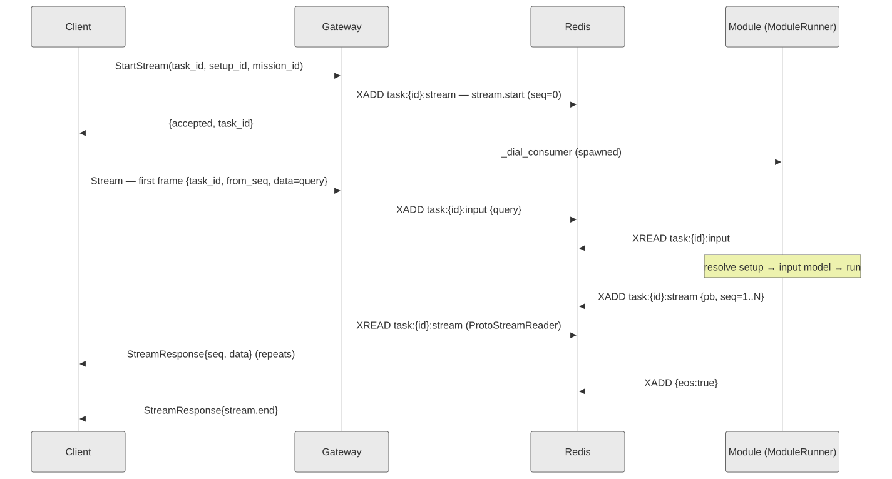

<!--
Diagrams here are inline ASCII on purpose: they render natively in Marp and are
verified against current source. The prebuilt docs/diagrams/*.svg are STALE
(they show the removed ProduceStream/ConsumeStream/checkpoint/idempotency design)
and are deliberately NOT referenced. Replace with corrected SVGs only after review.
-->

# DigitalKin SDK
## The Server: Redis-first transport & the new gRPC protocol

A platform walkthrough for the fullstack team

<br>

Sections: **API** · **Architecture** · **Redis** · **Overall & comparison**

---

## Why this talk

It's now a **platform**, not a library: a thin **Gateway**, a **Redis** data+signal plane,
and modules that never talk to each other directly.

Just as important — we **deleted** the old stack (Taskiq, RabbitMQ, SurrealDB, gRPC loopback)
instead of porting it. What ships today is **leaner**, not bigger.

> Three takeaways: **(1)** a 3-RPC API you integrate against · **(2)** Redis is the
> backbone — durability, reconnection, isolation, signals · **(3)** we optimized by
> *removing*, not adding.

---

## v0.3.x → today

| | v0.3.x — Library | **today (Redis-first)** |
|---|---|---|
| Transport | direct gRPC to module | **Redis Streams only** |
| Gateway RPCs | — (module RPCs) | **3 (StartStream / Stream / SendSignal)** |
| Signals | in-memory (broken x-proc) | **Redis pub/sub, direct cancel** |
| Durability | none | **stream + state in Redis** |
| Extra deps | Taskiq, RabbitMQ, SurrealDB | **none — just Redis** |

---

## Where we started — v0.3.x pain

```
Client ── gRPC ──► ModuleServicer.StartModule ──► SingleJobManager ──► module.run()
                         (fresh instance per call)        │
                         signals: DefaultTaskManager  ────┘  (in-memory queues)
```

- Client talks **straight to the module** — no broker, no session, no capacity control.
- **Signals broken across processes**: gateway published, the in-memory manager listened
  elsewhere — cancel never reached the task.
- ~**12 ms** gRPC loopback floor on dispatch; **no durability**, **no reconnection**.
- Distributed mode meant Taskiq + RabbitMQ + SurrealDB — a second moving system.

> Fine as a library. Not a platform.

---

# Part 1 — The API
### What a fullstack client actually talks to

---

## Three RPCs. That's the whole surface.

```proto
service GatewayService {
  rpc StartStream(StartStreamRequest) returns (StartStreamResponse);   // unary
  rpc Stream(stream StreamClient)     returns (stream StreamServer);    // BiDi
  rpc SendSignal(ClientSignalRequest) returns (ClientSignalResponse);  // unary
}
```

| RPC | Type | What it does |
|---|---|---|
| `StartStream` | unary | Reserve a task slot, dispatch the module. Returns `{accepted, task_id}`. |
| `Stream` | **BiDi** | First frame carries the **query**; server streams output frames back. |
| `SendSignal` | unary | Out-of-band: **cancel** a task, or **invalidate** caches. |

Source of truth for integrators: **`docs/gateway_protocol.md`** (Python + TS quick-starts).

---

## Wire shape — flat messages, one discriminator

```
StartStreamRequest  := { task_id, setup_id, mission_id }
StartStreamResponse := { accepted, task_id }

StreamClient  := { from_seq, task_id, data: Struct }   // client → gateway
StreamServer  := { seq,      task_id, data: Struct }   // gateway → client

ClientSignalRequest  := { task_id, action: SignalAction }
ClientSignalResponse := { success, task_id }
```

- No envelopes, no `oneof`. Payload type lives **inside** `data.root.protocol`.
- `task_id` is **client-chosen** (UUIDv4). It's the universal key: Redis, signals, logs, metrics.
- `setup_id` must start with `setups:`, `mission_id` with `missions:`.

> One Struct shape everywhere: `data = { root: { protocol, … }, annotations: {} }`.
> `DataTrigger` (the `root`) + `DataModel` (the wrapper) — protocol routes to a `TriggerHandler`.

---

## Lifecycle is in-band — the `stream.*` sentinels

Every control event is a normal `data` frame whose `root.protocol` starts with `stream.`:

| `protocol` | fields | meaning |
|---|---|---|
| `stream.start` | task_id, mission_id, setup_id, started_at | **first** entry, always (seeded by gateway) |
| `stream.error` | code, message, fatal | failure; if `fatal=true`, `stream.end` follows |
| `stream.end`   | task_id | **last** entry, always — the universal terminator |
| `stream.init`  | — | dial-back handshake (M2M) — see Part 2 |

- **Single-terminator invariant**: every stream ends with exactly one `stream.end`.
  A fatal error is **two** writes — `stream.error(fatal=true)` then `stream.end`.
- Module domain output uses **unprefixed** protocols (`agui_*`, `text_chunk`, …) — can't collide.
- `code` values follow gRPC status names (`INVALID_ARGUMENT`, `NOT_FOUND`, `RESOURCE_EXHAUSTED`…).

---

## Errors are data, not exceptions

> A misbehaving `Stream` does **not** raise `AioRpcError` from the iterator.
> It yields `stream.error`, then `stream.end`, then closes cleanly.

```python
async for msg in stub.Stream(client_stream()):
    proto = msg.data.fields["root"].struct_value.fields["protocol"].string_value
    if proto == "stream.start":  continue
    if proto == "stream.error":  log(...); continue   # fatal? stream.end is next
    if proto == "stream.end":    break
    handle(msg.data)                                   # your domain output
```

- Iterate the stream as **data-only**. Reserve `try/except AioRpcError` for transport faults
  (channel down, deadline exceeded) — not for application errors.
- Why: one uniform observation surface across languages; errors **persist in Redis** (resumable).

---

## Resume, cancel, invalidate

**Resume — `from_seq`** (no extra fields):
- *Stateless* (web UI): always send `from_seq=0`, replay from the top, ignore `seq`.
- *Stateful* (durable consumer): track highest `seq`, reconnect with `from_seq=<that>`.
  Gap if `seq != prev+1` → upstream trim. Resume window = Redis stream retention.

**Cancel** — `SendSignal(action=CANCEL, task_id)` → publishes on `signal_ch:<task_id>`; the
module shuts down; your `Stream` ends with the usual `stream.end`.

**Invalidate** — `SendSignal(action=INVALIDATE_*)` is **server-wide**, no task_id, does not touch
in-flight tasks (dict-swap preserves their refs):
`INVALIDATE_ALL / CHANNELS / MODELS / SETUP / TOOLS / SHARED`.

---

# Part 2 — Design & Architecture
### Three moving parts, one data plane

---

## The component map


The gateway holds **no data** — only a session reference + a stop event. Everything durable is in Redis.

---

## Request data flow — end to end



`StartStream:156` · `Stream:308` · `_consume_from_redis:542` · `module_runner._on_output:101`

---

## The task layer

`core/task_manager/` — runs the module and supervises its lifecycle.

- **`ModuleRunner.run()`** — one task end-to-end: setup → input model → `preload_instance`
  → `run_instance`. Maps failures to in-band errors:
  `ValidationError → INPUT_VALIDATION_ERROR`, `BackpressureTimeoutError → BACKPRESSURE_TIMEOUT`,
  anything else `→ MODULE_RUNTIME_ERROR` (via `on_fatal`, which writes `stream.error`+`stream.end`).
- **`TaskExecutor`** — supervisor running two coroutines: the **main** task and the **signal
  listener**. Direct cancellation (no `FIRST_COMPLETED` race).
- **`BaseTaskManager`** — admission control: two semaphores, `_system_gate` (fast reject) +
  `_task_slot` (patient wait), plus a bounded queue. `LocalTaskManager` runs in-process;
  `RemoteTaskManager` registers metadata for a worker.
- **`TaskSession`** — per-task state; `pending_signal_action` is set by the signal listener.

---

## Signal flow — out of band, never in the data path



- **One** `SharedRedisListener` per process (UUID id — `getpid()` is always 1 in Docker).
- `signal_ch:{task_id}` = per-task (cancel/stop). `signal_ch:_global_` = broadcast (invalidate).
- No per-task queue, no batching layer in the receive path — **direct `task.cancel()`**.
- Listen loop self-heals: exponential backoff `0.1s → 10s` on Redis errors.

---

## M2M & dial-back — modules calling modules

A module can be a **consumer** of another module. The gateway brokers it; the two never connect.

```
Gateway (gRPC client)                         Consumer module (gRPC server)
   │  StreamClient{ data: stream.init } ─────►│
   │  ◄──── StreamServer{ data: query } ──────│   consumer sends the query
   │  StreamClient{ seq=N, data: output } ───►│   gateway pushes outputs (from Redis)
   │  StreamClient{ data: stream.end } ──────►│   terminator
```

- Opt in with metadata `x-client-address: host:port` on `StartStream` → gateway **dials back**.
- `M2MCallRegistry` guards every outbound call: concurrency cap (**200**), **per-target circuit
  breaker** (open after 5 fails, 30 s probe), TTL sweeper (300 s) for calls whose `finally` never ran.
- Same 3 RPCs, direction inverted — no extra proto.

---

## Resilience surface — deliberately small

What actually ships today:

| Pattern | Where | Behaviour |
|---|---|---|
| **Admission** | `BaseTaskManager` | `_system_gate` + `_task_slot` semaphores + bounded queue |
| **Backpressure** | `module_runner` write path | throttle at 80% of `maxlen`, 30 s timeout → `BACKPRESSURE_TIMEOUT` |
| **Circuit breaker** | M2M + `grpc_client_wrapper` | per-target fail-fast, no 30 s hangs on dead peers |
| **Bulkhead** | `core/resilience/bulkhead.py` | per-service concurrency ceiling |

**Left out, on purpose**: WatchdogThread, SessionReaper, GracefulShutdown, StartupRestorer,
checkpoints, Lua idempotency claims.

> Every survivor earns its place on the hot path. The rest was speculative.

---

# Part 3 — Redis
### The backbone: durability, decoupling, reconnection, signals

---

## Why Redis carries everything

The producer (module) and consumer (client) are **decoupled in time**:

- **Durability** — output is persisted before the consumer reads it. Process dies → tokens survive.
- **Reconnection** — client drops and resumes from `from_seq`; no data lost in the window.
- **Isolation** — modules see only Gateway + Redis, never each other. Clean M2M boundary.
- **Cross-process signals** — pub/sub reaches a task in another process in ~1–2 ms (the thing
  the old in-memory manager could not do).
- **Horizontal scale** — session state in Redis means any gateway instance can serve any stream.

The cost is a real dependency (a SPOF) and a few ms per hop. Part 4 covers the trade.

---

## The Redis key map (current)


Gone vs the old design: `checkpoint:{id}`, `idem:{id}` (Lua claims), `checkpoints:active`,
`signal:{id}` hash. Durability now rides on the stream + state hash alone.

---

## RedisClient — split pools

One connection manager, built at startup and **injected** everywhere (DI). The gateway *borrows* it — never owns or closes it.

```python
# two independent pools over the same URL, raw bytes (no decode)
self._client          = Redis.from_url(url, max_connections=default_size,  decode_responses=False)
self._blocking_client = Redis.from_url(url, max_connections=blocking_size, decode_responses=False)
```

- **Why split**: a blocking `XREAD` holds its connection for up to `block_ms`. Under load, many
  readers on a shared pool exhaust it and stall writers. Isolating the reader pool means
  `XADD`/`HSET`/`PUBLISH` always have a free connection.
  - `_client` (non-blocking): `XADD`, `HSET`/`HGETALL`, `PUBLISH`/`pubsub`, `GET`/`SET`, `EXPIRE`, `pipeline`…
  - `_blocking_client`: **only** `XREAD`.
- **`decode_responses=False`** — values stay raw bytes, so the proto read is true zero-copy (`ParseFromString`).
- **Sizing**: `POOL_SIZE=2000`, auto-split 50/50; override each side with `POOL_SIZE_DEFAULT` / `POOL_SIZE_BLOCKING`.
- **`verify()`** pings both pools concurrently at boot (`gather` + 5 s timeout) → first XADD/XREAD skip cold DNS+TCP+AUTH. The gateway **refuses to start** if either ping fails.
- **`health_check_interval=15 s`** PINGs idle sockets — silently-dead connections are caught early, not mid-stream.

---

## Streams — the hot path

Two keys per task: **`:stream`** (module → gateway → client) and **`:input`** (client → gateway → module).

**Write** — module side, `module_runner._on_output`: a **direct `XADD`** (no writer abstraction).

```
seq=0    stream.start            ← seeded by the gateway in StartStream
seq=N    XADD :stream {pb, seq}  MAXLEN ~1000 (approx trim)   ← one per output chunk
first XADD arms EXPIRE 600s ;  stream.end → XADD {eos:"true"} + EXPIRE 60s
```

**Read** — gateway side, `ProtoStreamReader`, zero-copy:

```
XREAD {:stream: last_id}  block=50ms  count=50   (dedicated blocking pool)
  bytes → Struct.ParseFromString()       ~0.1–0.5 ms
  vs JSON: json.loads → dict → update    ~3–8 ms
```

- `seq` monotonic from 1 → **gap detection**; the `eos:"true"` marker ends the read loop.
- **Cursor** (`:cursor`) saved every **100** entries (TTL ~6 min) → a crash re-reads ≤ 100 entries, not the whole stream.
- **Poison entry** (corrupt `pb`) is dropped and logged *per item* — the stream stays alive.
- **Backpressure**: the writer throttles at 80 % of `maxlen`, 30 s ceiling → `BACKPRESSURE_TIMEOUT`.
- `ProtoStreamWriter` (old adaptive single/batch flush) — **removed**; per-`XADD` is fast enough and leaves no buffer to flush or lose on crash.

---

## State & signals in Redis

**State — the P1 invariant** (`RedisStateManager`):

```python
pipe.hset("task:{id}", mapping={status, started_at, …})
pipe.expire("task:{id}", task_ttl)     # HSET + EXPIRE in one round-trip
await pipe.execute()                    # Redis write BEFORE in-memory update
```

> If the process dies between the Redis write and the memory update, the system is still
> consistent — Redis is the source of truth. TTL 24 h, auto-reaped.

**Signals — `SharedRedisListener`**: one `PSUBSCRIBE signal_ch:*` per process; JSON payload
carries `action`, `published_at_ns` (latency audit), and `origin` (skip self-invalidation).
Dedup on the raw JSON guards against pub/sub replay.

---

# Part 4 — Overall
### Comparison and trade-offs

---

## Old vs new — at a glance

| Dimension | v0.3.x (library) | **today (Redis-first)** |
|---|---|---|
| Primary transport | direct gRPC to module | **Redis Streams** |
| Gateway RPCs | none (rich module API) | **3** (Start/Stream/Signal) |
| Producer → gateway | gRPC loopback (~12 ms) | **module XADDs to Redis** |
| Lifecycle / errors | proto enums + gRPC status | **in-band `stream.*` sentinels** |
| Signals | in-memory (broken x-proc) | **Redis pub/sub (~1–2 ms)** |
| Durability / resume | none | **stream + state hash + `from_seq`** |
| Module isolation | caller hits module | **A ↔ Redis ↔ GW ↔ Redis ↔ B** |
| Heavy deps | Taskiq, RabbitMQ, SurrealDB | **none — just Redis** |
| API ownership | module exposes its own gRPC (~10 RPCs) | **gateway owns the API; module = business logic** |

**Business ⊥ API.** In v0.3.x the module server *was* the API — business logic and transport
coupled in one `ModuleServicer`. Now the **gateway owns the API surface** (transport, sessions,
streaming, signals, resilience); the **module is pure business logic** — read input, write output
to Redis. Change the wire without touching a module; change a module without touching the wire.

---

## What we deliberately removed

The biggest design decision was **subtraction**:

- **Infra**: Taskiq workers, RabbitMQ (`rstream`, `aio-pika`), SurrealDB, `asyncio-inspector`.
- **Transport**: gRPC loopback, the `ProduceStream`/`ConsumeStream` RPCs, the `GatewayResponse`
  envelope, `StreamStatus`/`ServerHeartbeat`/`Checkpoint` messages.
- **Machinery**: `ProtoStreamWriter`, Redis checkpoints, Lua idempotency claims, WatchdogThread,
  SessionReaper, GracefulShutdown, StartupRestorer, the CB interceptor.

> Every removal collapsed a code path. The 3-RPC + sentinel surface can express everything the
> deleted messages did — so they had to justify their existence, and couldn't.

---

## The numbers — SDK overhead (microbenchmarks)

| Metric | v0.3.x | today | note |
|---|---|---|---|
| Dispatch (client → task start) | ~25 ms | **~3 ms** | gRPC loopback → Redis XADD |
| Module init (2nd+ call) | ~441 ms | **~185 ms** | `context.shared` server-lifetime cache |
| Signal delivery | broken (in-proc only) | **working, ~1–2 ms** | Redis pub/sub |
| Throughput ceiling (healthcheck) | ~25 req/s, 49% errors @ c=100 | absorbs burst via queue | admission + queue |

> ⚠️ Directional: v0.3.x = March-2026 Railway benchmark, today = local micro-probes — not a
> controlled A/B. **Real, current end-to-end numbers on the next slide.**


---

## Real-env load test — 50 × 1200 s, hosted platform

**Setup**: laptop → 50 workers → Railway gateway, **dial-back over ngrok**, agentic module
(~27 events/call), uvloop + client gzip off, 180 s call timeout. *(2026-06-18)*

| Metric (p50 / p95 / p99) | value |
|---|---|
| **Transport first byte** — StartStream → 1st msg | **86 ms / 145 ms / 294 ms** |
| 2nd message | 181 ms / 273 ms / 843 ms |
| Model TTFT — → 1st text | 13.8 s / 21.0 s / 25.4 s |
| Full call — → `stream.end` | 21.5 s / 30.2 s / 34.7 s |

- **2,734 calls · 2.28 iter/s · 61.6 msg/s · 0 failures** over 20 min; throughput + p50 latency **flat** the whole run (CoV 0.20).
- Transport: first byte p50 **86 ms**, max 695 ms, **0 calls > 1 s**; **0 calls exceeded even a 60 s ceiling** (max full call 47.9 s). The ~21 s call is **almost all LLM** (TTFT 13.8 s).
- Remaining tail is **model-side**: 1,249 mid-stream gaps > 10 s (LLM pauses), not transport.

---

## Trade-offs — eyes open

**Gained**: crash durability · `from_seq` reconnection · module isolation · ~1–2 ms cross-process
signals · capacity/admission control · a 3-RPC surface anyone can integrate against.

**Paid**:

| Cost | Why it's worth it | Mitigation |
|---|---|---|
| **Redis is a SPOF** | durability, reconnection, isolation, signals | HA Redis; gateway fails fast on boot if unreachable |
| **+~1 ms per state write** | crash-consistent state (P1) | HSET+EXPIRE pipelined, 1 RTT |
| **+~1 ms per output chunk** | durable + resumable output | `maxlen`-bounded stream, batched reads |
| **+1 gateway hop** | full module isolation + signals | required; ~0.5 ms |

---

## Config — typed, scoped, one factory each

All knobs are `pydantic-settings`, scoped by prefix, read via an `@lru_cache` factory:

| Prefix | Controls |
|---|---|
| `DIGITALKIN_REDIS_` | pool size/split, `TASK_TTL`, `CURSOR_TTL`, health check |
| `DIGITALKIN_REDIS_STREAM_` | `MAXLEN`, `TTL`, batch size |
| `DIGITALKIN_GATEWAY_` | `MAX_STREAMS`, dial-back idle/lifetime/grace |
| `DIGITALKIN_GATEWAY_STREAM_` | stream `MAXLEN`/`TTL`, `READ_BLOCK_MS`, `from_seq` ceiling |
| `DIGITALKIN_STREAM_` | backpressure threshold/timeout |
| `DIGITALKIN_M2M_` | concurrency cap, breaker, TTL sweeper |
| `DIGITALKIN_SIGNAL_` | signal queue/batch sizes |

No bare `DIGITALKIN_`, no per-field copies — `get_*_settings()` everywhere.

---

## Testing — tiers map to the failure modes

Markers declared in `pyproject.toml`; target a concern with `uv run pytest -m <marker>`.

| Marker | Active | Covers |
|---|---|---|
| `grpc` · `integration` | 129 · 109 | gateway / RPC behavior · real Redis + gRPC |
| `smoke` | 62 | critical path, always-green |
| `edge_case` · `validation` | 28 · 27 | boundaries · input / schema |
| `property` · `regression` | 4 · 4 | Hypothesis invariants · fixed bugs |
| `stress` · `chaos` · `flaky` | 2 · 1 · 1 | load · fault injection · quarantine |

- **Real-Redis rule**: fakeredis / `_FakePubSub` unit tests are paired with `integration` tests
  against the dockerized Redis. CI deselects with `-m "not integration"`.
- **Declared but not yet populated**: `concurrency`, `contract`, `e2e`, `idempotency`,
  `stability` — taxonomy is ready, coverage is aspirational (`idempotency` the *feature* is gone).

---

## Takeaways

**For the fullstack team:**
1. Integrate against **3 RPCs**; dispatch on `data.root.protocol`; treat the stream as **data-only**.
2. `stream.start` … your output … `stream.end`. Errors are frames, not exceptions.
3. Cancel via `SendSignal`; resume via `from_seq`; push mode via `x-client-address`.

**The three things:** **API** — 3 RPCs, sentinels, errors-as-data · **Redis** — the durable
backbone (streams, state, signals, resume) · **Lean** — we shipped by deleting.

Reference: **`docs/gateway_protocol.md`** (Python + TS quick-starts) · code: `grpc_servers/gateway_servicer.py`, `core/task_manager/`.
